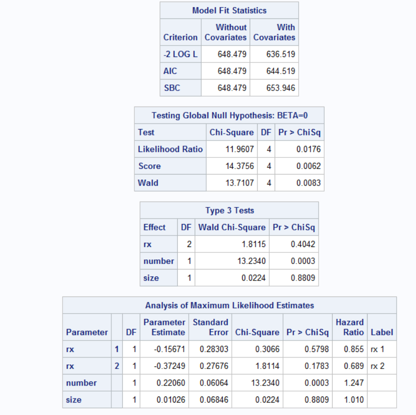
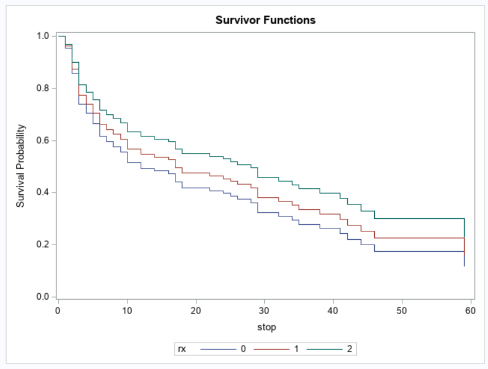
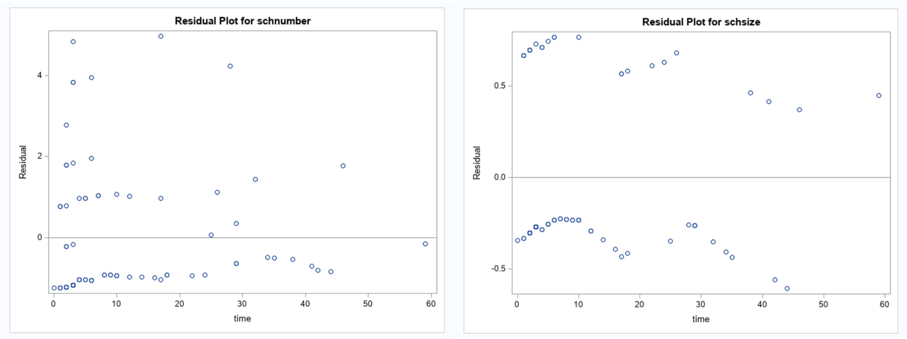
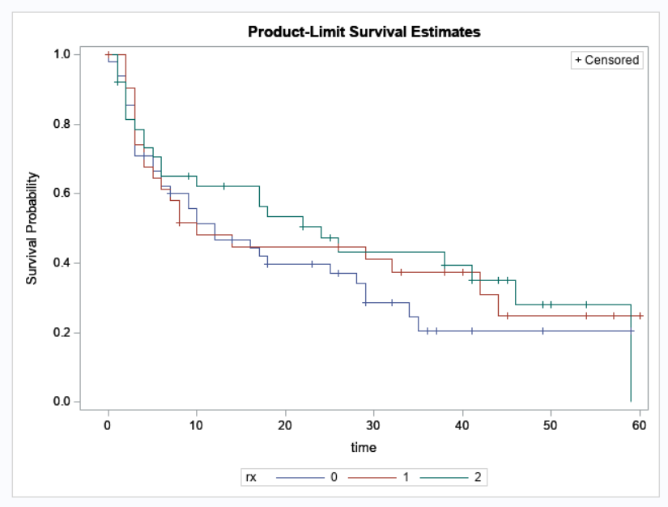
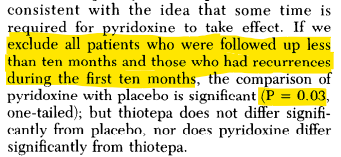
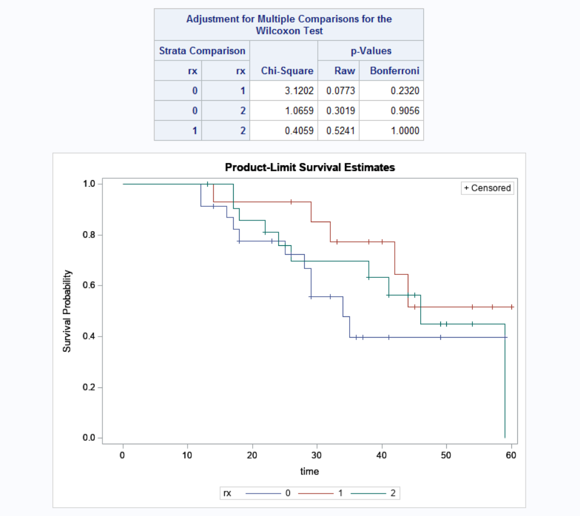

```{r setup, include=FALSE}
knitr::opts_chunk$set(echo = FALSE, warning = FALSE, messages = FALSE)
```

```{r, include=FALSE}
library(survival)
library(tidyverse)
library(ggfortify)
library(ggplot2)
```

```{r, include=FALSE}
theme_set(
  theme_bw() +
    theme(
      legend.position = "bottom",
      plot.title = element_text(hjust = 0.5),
      plot.subtitle = element_text(hjust = 0.5),
      plot.caption = element_text(hjust = 0.0)
    )
)
options(
  ggplot2.continuous.colour = "viridis",
  ggplot2.continuous.fill = "viridis"
)
scale_colour_discrete = scale_colour_viridis_d
scale_fill_discrete = scale_fill_viridis_d

bladder1 <- survival::bladder1
```

# Background

## Superficial Bladder Cancer

- Also known as Stage 1 bladder cancer
- Common diagnosis (75% of bladder cancer cases$^1$) and rarely life-threatening on its own.
- Thought to arise due to urinary issues$^1$ or through "abnormalities of tryptophan metabolism"$^2$
- Natural history study conducted in Sweden saw that "death was directly related to tumor grade, number of tumors, and volume of recurrences."$^3$

## Pyridoxine and Thiotepa

- _Pyridoxine_ (vitamin $B_6$) thought to reduce "abnormalities of tryptophan metabolism"
- _Thiotepa_ has been the standard of care for the treatment of superficial bladder cancers.
- Effects of these two therapies compared in randomized clinical trial conducted by Byar and Blackard in 1977

## Byar and Blackard (1977)

- Primary clinical interest: prevent and reduce recurrence of Stage 1 bladder cancer.
- Event time agnostic analysis conducted included comparing overall rates and percentages of occurrence between groups
  - Pairwise difference detected in rate of recurrence between thiotepa and placebo, and thiotepa and pyridoxine
  - No other differences in event incidence between groups detected
- Survival analysis conducted involved the construction of life-table estimates.
  - Life-table analysis indicate that the time to first recurrence was significantly different between pyridoxine and placebo groups.
  - Secondary analysis restricted to subjects who experienced recurrence after at least 10 months of follow-up

# Proposed Project

## Motivation

- Clinical interest in seeing if any of the three treatments decrease incidence of event (recurrence, death) or time to those events.
- Research ought to be reproducible, especially if data are open-source

## Analysis Plan

1. Use non-survival analysis methods to see if differences in recurrence and overall status exist between treatment groups, irrespective of time.
2. Construct survival models to analyze recurrence trends to see if differences exist between treatment groups in time to first recurrence, with initial tumor number and initial largest tumor size as covariates. 
  - Semi-parametric: Cox Proportional Hazards Model
  - Parametric: Weibull and Exponential Models 
  - Non-parametric: KM
3. Compare results to original Byar and Blackard study.
  
## bladder1 Dataset

- `id`: Patient ID
- `treatment`: Placebo, pyridoxine (vitamin B6), or thiotepa
- `number`: Number of tumors at beginning of study (BOS)
- `size`: Size of largest tumor at BOS
- `recur`:	Number of recurrences
- `start`, `stop`:	The start and end time of each time interval
- `status`:	Patient status at end of interval
  - 0: Censored
  - 1: Recurrence
  - 2: Death from bladder disease
  - 3: Death from other/unknown cause
- `rtumor`: Number of tumors at time of recurrence.
- `rsize`: Size of largest recurrent tumor at time of recurrence.
- `enum`: Event number (by patient)

# 0. Exploratory Data Analysis

## Counts by Treatment Group

```{r}
final_status <- 
  bladder1 %>% 
  group_by(id) %>% 
  mutate(total_recs = n(),
         new_enum = -enum + total_recs + 1,
         rsize = ifelse(rsize == ".", NA, as.numeric(rsize)),
         rtumor = ifelse(rtumor == ".", NA, as.numeric(rtumor)),
         treatment = str_to_title(treatment),
         treatment = str_to_title(treatment),
         recur = factor(recur, levels = 0:9),
         status = factor(status, 
                         levels = 0:3, 
                         labels = c("Censored", "Recurrence", "Death (bladder disease)", "Death (other reasons)"))
         ) %>% 
  filter(new_enum == 1) 

total <- 
  bind_rows(
    final_status,
    final_status %>% mutate(treatment = "Total")
  )

counts = 
  total %>%
  unique() %>%
  group_by(treatment) %>%
   mutate(
    recur = recur %>% as.character() %>% as.numeric()
  ) %>%
  summarise(
    total = n(),
    n_censored = sum(status == 0),
    n_recurrence = sum(recur > 0),
    n_wo_recurrence = sum(recur == 0),
    n_died = sum(status %in% c("Death (bladder disease)", "Death (other reasons)" ))
  ) %>%
  pivot_longer(
    cols = total:n_died,
    names_to = "count") %>%
  pivot_wider(
    id_cols = count,
    names_from = treatment,
    values_from = value
  ) %>%
  mutate(
    col_labels = c("Total Subjects", "Number Censored", "Number with Recurrence",
                   "Number without Recurrence", "Number Died")
  ) %>%
  relocate(col_labels) %>%
  select(-count)

counts %>%
  knitr::kable(
    col.names = c("", "Placebo", "Pyridoxine", "Thiotepa", "Total")
  )
```

## Descriptive Statistics by Treatment Group

```{r}
stats = 
  total %>%
  unique() %>%
  group_by(treatment) %>%
  mutate(
    recur = recur %>% as.character() %>% as.numeric()
  ) %>%
  summarise(
    total_n = n(),
    num_recur = sum(recur != 0),
    percentage_recur = (sum(recur != 0)/n())*100,
    avg_tos = mean(stop),
    med_time_on_study = median(stop),
    total_time_on_study = sum(stop),
    total_recur = sum(recur),
    rate_recur = (sum(recur)/total_time_on_study) * 100,
    ) %>%
  pivot_longer(
    cols = total_n:rate_recur,
    names_to = "count") %>%
  pivot_wider(
    id_cols = count,
    names_from = treatment,
    values_from = value
  ) %>%
  mutate(
    col_label = c(
      "Total Subjects",
      "Number of Subjects with Recurrence",
      "% Recurrence",
      "Average Time on Study",
      "Median Time on Study", 
      "Total Time on Study",
      "Number of Recurrences",
      "Rate Recurrence (per 100 person-months)"
    )
  ) %>%
  relocate(col_label) %>%
  select(-count)

stats %>%
  knitr::kable(
    col.names = c("", "Placebo", "Pyridoxine", "Thiotepa", "Total"),
    digits = 2
  )
```

## Tumor Descriptive Statistics

```{r}
stats2 = 
  total %>%
  unique() %>%
  group_by(treatment) %>%
  mutate(
    recur = recur %>% as.character() %>% as.numeric()
  ) %>%
  summarise(
    avg_n_tumors = mean(number),
    med_tumor = median(number),
    avg_tumor_size = mean(size),
    med_size = median(size),
    avg_recur = mean(recur),
    med_recur = median(recur),
    mean_tumor_at_recur = mean(rtumor, na.rm = TRUE),
    med_tumor_at_recur = median(rtumor, na.rm = TRUE)
    ) %>%
  pivot_longer(
    cols = avg_n_tumors:med_tumor_at_recur,
    names_to = "count") %>%
  pivot_wider(
    id_cols = count,
    names_from = treatment,
    values_from = value
  ) %>%
  mutate(
    col_label = c(
      "Average # of Tumors (BOS)",
      "Median # of Tumors (BOS)",
      "Average Largest Tumor Size (BOS)",
      "Median Largest Tumor Size (BOS)",
      "Average # of Recurrences",
      "Median # of Recurrences", 
      "Average # Tumors at Recurrence",
      "Median # of Tumors at Recurrence"
    )
  ) %>%
  relocate(col_label) %>%
  select(-count)

stats2 %>%
  knitr::kable(
    col.names = c("", "Placebo", "Pyridoxine", "Thiotepa", "Total"),
    digits = 2
  )
```

## Distribution of Number of Recurrences by Treament

```{r, echo=FALSE, message=FALSE, warning=FALSE}
final_status %>%
  ggplot(aes(x = recur, fill = recur)) + 
  geom_bar(stat = "count", 
           position = position_dodge2(),
           color = "black") +
  labs(x = "Recurrences", 
       y = "Number of Patients") + 
  theme(legend.position = "none") +
    facet_wrap(~treatment)


# we see that unlike the placebo and pyridoxine groups, no patients in the thiotepa group experienced more than 7 recurrences. 
```

## Distribution of Final Status by Treatment

```{r,echo=FALSE, message=FALSE, warning=FALSE}
final_status %>%
  group_by(treatment, status) %>%
  ggplot(aes(x = status, fill = factor(status))) + 
  geom_bar(stat = "count", 
           position = position_dodge2(),
           color = "black") +
  labs(x = "Status", 
       y = "Number of Patients") + 
    theme(legend.position = "none",
          axis.text.x = element_text(angle = 45, hjust = 1)) +
    facet_wrap(~treatment)
```


## Distribution of Number of Tumors and The Largest Initial Tumor Size (BOS)

```{r, echo=FALSE, message=FALSE, warning=FALSE}
final_status %>%
  ggplot(aes(x = number, 
             y = size, 
             size = recur,
             color = status)) + 
  geom_point(alpha = .7,
             position = "jitter") +
  lims(x = c(1, 10), y = c(1, 10)) +
  scale_x_continuous(breaks = 1:9) +
  scale_y_continuous(breaks = 1:9) +
  labs(x = "Number of Tumors", 
       y = "Size of Largest Tumor",
       color = "Final Status",
       caption = "Note: Size of point on plot determined by number of recurrences."
       ) +
  guides(color = "legend", size = "none") +
  facet_wrap(~treatment)
```

# 1. Non-Survival Analysis

## Absolute Comparison: Counts of Events by Treatment (Poisson Regression)

`glm(n ~ status + recur + treatment, family = "quasipoisson")`


```{r}
final_counts <- 
  final_status %>% 
  mutate(treatment = str_to_title(treatment),
         status = factor(status),
         recur = factor(recur)) %>%
  select(id, treatment, status, recur) %>% 
  group_by(treatment, status, recur) %>%
  summarise(n = n(),
            .groups = "drop") %>%
  complete(treatment, status, recur) %>%
  replace_na(list(n = 0)) %>%
  arrange(treatment, status, recur)

count_glm <- glm(n ~ status + recur + treatment, data = final_counts, family = "quasipoisson")

# quasipoisson specified to adjust for overdispersion (not much, as DP is 1.517)
# indicates distribution of counts by final status and recurrence do not differ between groups
count_glm %>% broom::tidy() %>% filter(term %in% c("treatmentPyridoxine", "treatmentThiotepa")) %>% knitr::kable(digits = 2)
```

## Relative Comparison: Frequencies of Events by Treatment (Chi-square Test)

```{r}
patient_summary <- 
  bladder1 %>% 
  group_by(id, treatment) %>% 
  mutate(
    time_diff = stop - start
  ) %>%
  summarise(
    total_time_in_study = sum(time_diff),
    total_recurrence = sum(status == 1),
    recurrence_rate =
      case_when(
        total_time_in_study == 0 ~ 0,
        TRUE ~ total_recurrence/total_time_in_study) * 100,
    .groups = "drop"
  ) 

treatment_summary <- patient_summary %>%
  group_by(treatment) %>%
  summarise(
    total_obs = n(),
    total_time_observed = sum(total_time_in_study),
    total_recurrences = sum(total_recurrence),
    calculated_recurrence_rate = total_recurrences/total_time_observed,
    avg_recurrence_rate = mean(recurrence_rate),
    scaled_recurrence_rate = calculated_recurrence_rate * 100
  )

to_chi_sq <- patient_summary %>%
  group_by(treatment) %>%
  summarise(
    any_recurrence = sum(total_recurrence > 0),
    no_recurrence = sum(total_recurrence == 0)
  ) 

to_chi_sq %>% knitr::kable()
chisq.test(to_chi_sq[2:3] %>% as.matrix())
```

## Relative Comparison: Rates of Events by Treatment (F-test)

- Assume that time to first recurrence follows an exponential distribution.
- Cox (1953)$^4$ proposes a pairwise comparison of rates by using the test statistic $F = \frac{T_1/(d_1 + 0.5)}{T_2/(d_2+0.5)}$
  - $T_1$ and $T_2$: total patient time for each treatment group
  - $d_1$ and $d_2$: total number of events for each treatment group
  - Degrees of freedom: $v_1 = (v_1' + v_1^*/2) = 2d_1 + 1$ and $v_2 = (v_2' + v_2^*/2) = 2d_2 + 1$

## Relative Comparison: Rates of Events by Treatment (F-test)

```{r}
rate_comparison <- function(comparison, t1, t2, d1, d2){
  f_stat <- (t1/(d1 + 0.5))/(t2/(d2 + 0.5))
  p_value <- pf(f_stat, 2*d1 + 1, 2*d2 + 1)
  return(list(
   comparison = comparison,
   p_value = p_value
  ))
}

# placebo vs. pyro
rate_comparison("placebo vs. pyro", 1528, 993, 87, 57)

# placebo vs. thio
rate_comparison("placebo vs. thio", 1528, 1183, 87, 45)

# pyro vs. thio
rate_comparison("pyro vs. thio", 993, 1183, 57, 45)
```

# 2. Survival Analysis: Time to First Recurrence

## Semi-parametric Approach: Cox-PH Model
<center>
  {width=75%}
</center>

## Semi-parametric Approach: Cox-PH Model Estimation



## Semi-parametric Approach: Cox-PH Assumptions
<center>
{width=105%}
</center>

## Semi-parametric Approach: Cox-PH Assumptions
<center>
  
</center>
  
## Parametric Approach: Exponential and Weibull Models
<center>
  {width=105%}
</center>
  
## Parametric Approach: Graphical Assessment of Parametric Model Assumptions (using KM)

<center>
  
</center>

## Non-parametric Approach: KM Estimate

<center>
  
</center>

# 3. Review of Original Study

## Review of Original Study

- Original study primarily focused on non-survival approaches, most results of which we were able to reproduce.
  - Only discrepancy existed wih original investigators reporting significant difference in rate of recurrence between both placebo/thiotepa and pyridoxine/thiotepa comparisons
  - Our analysis only indicated a significant difference in recurrence rate between placebo/thiotepa, consistent with KM findings
- Survival analysis results were similar
  - No difference between groups were found in the non-parametric approaches (KM in our project and life table in original study).

## Difference in Survival Curves after 10 months?

<center>
  
</center>

- Notwithstanding the accuracy of this statement, this p-value actually should not be taken as significant. 
- 6 comparisons will have been conducted in total, need to adjust for multiple comparison (significance level will be < 0.03 if using Bonferroni's adjustment)

## Difference in Survival Curves after 10 Months?

<center>
  
</center>

# Conclusion

## Conclusion

- Treatments proposed in this study seemed to be much less effective than hypothesized in the prevention of superficial bladder cancer recurrence in both recurrence incidence and time-to-recurrence outcomes.
  - Thiotepa appears to have some effect in reducing rate of recurrence.
- Most results in study are reproducible, with some multiple comparison discrepancies.
- Natural history of superficial bladder cancer may have impacted non-significance of most results
  - Surgical treatments are usually most effective$^{1, 5}$
- Future studies can consider collecting time-varying covariates to improve ability to model time-to-recurrence outcome.

# Thank you!

## References

1. Superficial bladder cancer. Division of Urologic Surgery. (n.d.). Retrieved from https://urology.wustl.edu/urologic-cancers/bladder-cancer/surgery-for-superficial-b/

2. C;, B. D. B. (n.d.). Comparisons of placebo, pyridoxine, and topical thiotepa in preventing recurrence of stage I bladder cancer. Urology. Retrieved from https://pubmed.ncbi.nlm.nih.gov/414402/ 

3. Pasin, E., Josephson, D. Y., Mitra, A. P., Cote, R. J., &amp; Stein, J. P. (2008). Superficial bladder cancer: An update on etiology, molecular development, classification, and natural history. Reviews in urology. Retrieved December 3, 2022, from https://www.ncbi.nlm.nih.gov/pmc/articles/PMC2312342/ 

4. Le, C. T. (1991). The relationship between two statistical tests ... - wiley online library. Retrieved from https://onlinelibrary.wiley.com/doi/abs/10.1002/bimj.4710330323 

## References

5. UpToDate. (n.d.). Retrieved from https://www.uptodate.com/contents/bladder-cancer-treatment-non-muscle-invasive-superficial-cancer-beyond-the-basics 


